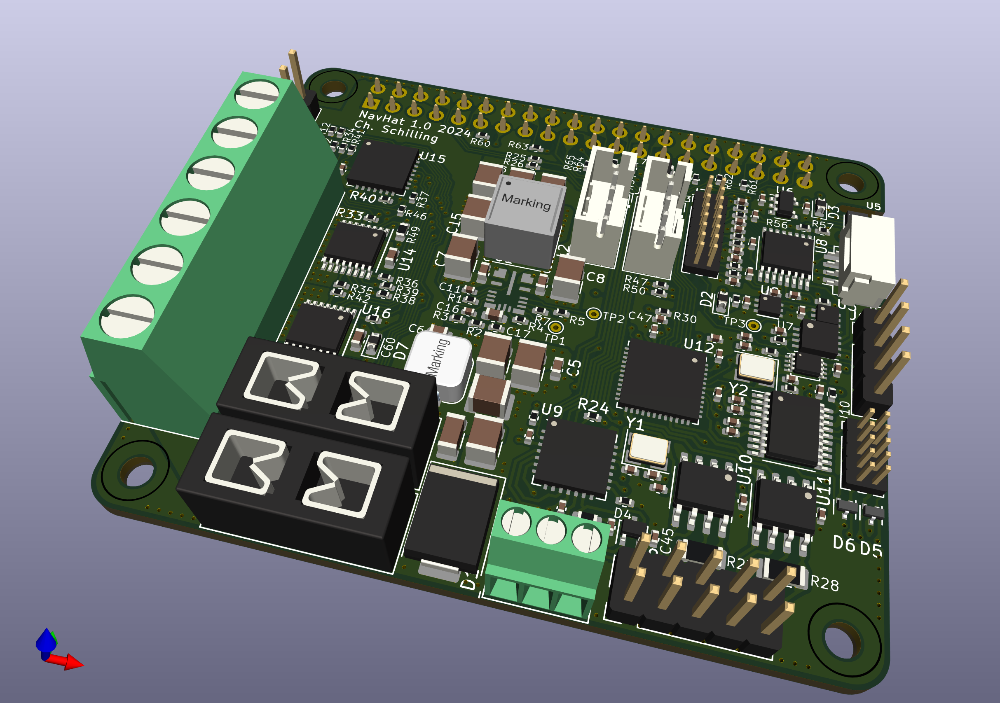

# Navigation HAT
The Navigation HAT is a board that connects on top of the Raspberry Pi computer by its 40 pin header. HAT stands for Hardware-Attached-on-Top, the specification can be found [here](https://datasheets.raspberrypi.com/hat/hat-plus-specification.pdf).

## Purpose
Navigation HAT is made to help embed the Raspberry Pi in a sailing boat. Of course, it can be used in many other use cases where the hardware features make sense.
On a sailing boat, one is consious about power consumption. Navigation HAT uses a wide input range, high efficiency and low noise step-down switcher. In operation, powered from the battery of the boat, its efficiency is approx. 95%.
In standby, it uses only a few µA. It can be woken up by a key or by the on-board real time clock (RTC).
Most boats use NMEA 2000 for information exchange between instruments, plotter, autopilot etc. The bus is based on CAN, therefore an important interface is the CAN bus. Older boats might use NMEA 0183, which is based on RS-422. Two UARTs in RS-422 configuration are populated as well.
To control other loads on the boat, there are four power outputs with current limitation and monitoring as well as other protective features. Barometric readings are essential for wheather observation. A high sensitivity barometric sensor is included. Several connectors are ready for attaching other sensors using a two-wire bus.

## [Installation](./NavHat-Installation.md)

## [Design](./NavHat-Design.md)

## Revision history
### Board Revision 1.0
This board revision is first built in April 2024. It is basically functioning. See CoC of the manufacturer in the documentation folder.

### Known issues
* The quad UART is not commissioned, yet.
* One-wire is not commissioned, yet.
* The quartz Y1 for the CAN device is a 20MHz version. Schematics needs to be fixed (shows 16MHz version)
* The Raspberry Pi 5 leaves its power-off pin in an undefinded state, too long. The signal oscillates and therefore power-off is not reliable. Use a 1KOhm resistor instead of a 100kOhm for R10. Raspberry Pi 4 is fine with the 100kOhm.
