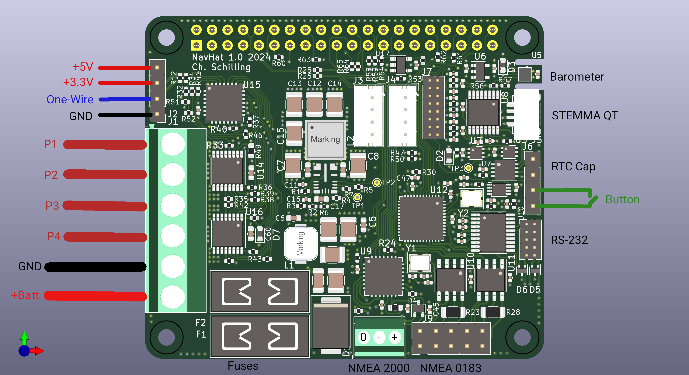

# Installation and Interface Description
Before powering the system, make sure the two fuses are installed. F1 is at the board edge and protects the power path to the Raspberry Pi. Populate with 3A typically. For example, use Littlefuse 0297003.wxnv. F2 is in the path to the power outlets. Let's assume to limit the sum of the current outlets to 20A. Therefore, one can use the Littlefuse 0297020.wxnv, as an example.

### Powering the system
J1 is the large screw terminal providing power to the system and connecting loads conrolled by the high-side switches. Positive voltage from the battery is connected closest to the fuses.

|Pin|Connection|
|:--|:---------|
|1|P1 Output|
|2|P2 Output|
|3|P3 Output|
|4|P4 Output|
|5|GND, Battery -|
|6|Supply, Battery +|

The screw terminals take wire sizes up to 2.5mm2.
> Warning! 
> Use either the USB Power of the Raspberry Pi or the supply for the Navigation HAT board. Do not use both at the same time!

### NMEA 2000 interface
J8 is the small screw terminal for the NMEA 2000 or CAN bus interface. Pin 1 is closest to the fuses.

|Pin|Connection|Color|
|:--|:----|:-------|
|1  |GND  |metallic|
|2  |CAN -|blue    |
|3  |CAN +|white   |

The colors refer to the NMEA cable specification. Use the metallic shield for ground connection.

### Power-on and RTC backup
J6 is reserved for RTC battery or super capacitor as well as the power-on button to switch the flip-flop and therefore start the DC/DC switcher.

|Pin|Connection|
|:--|:-------|
|1|GND       |
|2|VBATT_RTC |
|3|POWER_ON  |
|4|GND       |

Connect POWER_ON to GND for an instant to turn on the system. This is a good application for a power button. 
> Note: It is planned to use the button during operation as a signal and long-press to initiate shut-down. This is not implemented, yet.

### One-Wire
J2 offers a One-Wire interface. The Bit-banging driver of the Raspberry Pi is used. There is a 5kOhm pull-up resistor on board for a seamless start.

|Pin|Connection|
|:--|:------|
|1|GND      |
|2|One-Wire |
|3|+3.3V    |
|4|+5V      |

The +5V is directly connected to the output of the DC/DC converter. +3.3V is made by the Raspberry Pi and is taken from the 40Pin header. Pin 1 is at the Label J2 or closest to J1.

### Auxilary header J7
J7 offers differential signals to the ADC inclusive external differential reference voltage. Four GPIOs from the Port extender, I2C and a linear 3.3V supply are fed to that header as well.

|Signal    |Pin|Pin|Signal       |
|:---------|:-:|:-:|:------------|
| GND      | 1 | 2 | LIN3V3      |
| SCL      | 3 | 4 | SDA         |
| GPIO_A4  | 5 | 6 | AIN3        |
| GPIO_A3  | 7 | 8 | AIN2        |
| GPIO_A2  | 9 | 10| REF_N       |
| GPIO_A1  | 11| 12| REF_P       |
| GND      | 13| 14| CurSenseRef |
| POWER_ON | 15| 16| CurSense    |

The current sense signals are hooked up to that header, too. Removing R47 and R50 looses current sense of the power outputs in favour of additional external analogue voltages. See schematics for applied filters to the ADC.

### STEMMA connectors J3 and J4
Two STEMMA connectors for external I2C devices are available. For reference, these signals are hooked up like the table below:

|Pin|Signal|
|:--|:-----|
|1 |SCL    |
|2 |SDA    |
|3 |LIN3V3 |
|4 |GND    |

Pin 3, LIN3V3 is powered from a linear regulator, not from the 3.3V of the Raspberry Pi.

### STEMMA QT / Qwiic connector J5

The miniature version of STEMMA can be used on J5. For reference, these signals are hooked up like the table below:

|Pin|Signal|
|:--|:-----|
|1 |GND    |
|2 |+3.3VA |
|3 |SDA    |
|4 |SCL    |

> Note: +3.3VA is powered from a linear regulator and is active, even when the DC/DC converter is disabled.

### NMEA 0183 / serial connectors
J9 and J10 are connectors for RS-232 and RS-422. Details will be updated later.
